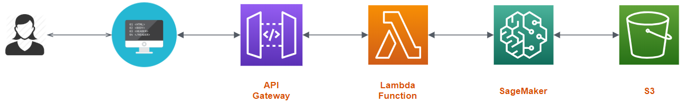

# Sagemaker Deployment

This repository contains materials for the udacity machine learning engineer nanodegree. In particular, my sentiment analysis web app is displayed in the `Project` folder.

# Sentiment Analysis Web App

In this web app, a user enters his personal review on a movie and, based on his review, the app tells him whether it was a *negative* or *positive* review. 

The infrastructure of the Web App is portrayed as follows: 

Once the user inputs its review text, the web page send an HTTP request to an **API Gateway** which handles the endpoint to which the request is redirectioned. For the sentiment analysis app, it calls a **Lambda Function** which is responsible for extracting the content of the HTTP request (namely the review text) and send it to a model which was developed using **Amazon Sagemaker**.

